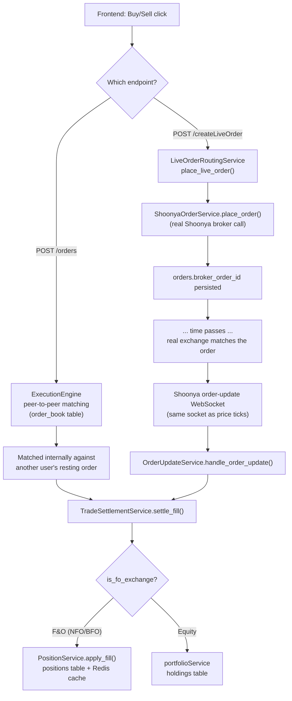

# Live Order Execution — Architecture & Line-by-Line Trace

This document explains, method by method, how a **real Shoonya F&O order**
moves through PrimePip from the `POST /createLiveOrder` request to the
position/wallet/order-status entries landing in Postgres. Written for
debugging — every step names the exact file, class, and method.

---

## 1. Architecture overview

PrimePip has **two completely separate execution lanes**. They share the
same order-creation plumbing but diverge immediately after:



**Key architectural decision**: once an F&O order is routed live, it
**never re-enters internal matching**. The broker is the sole source of
truth for that order's fill. Both paths converge on the exact same
`TradeSettlementService.settle_fill()` call — no separate position/wallet
math exists for live vs. simulated fills, only the trigger that calls it
differs (an internal match vs. a broker WebSocket message).

---

## 2. Placing the order — request-time (synchronous)

**Entry point:** `POST /createLiveOrder` → `api/orders.py::create_live_order`

1. **Auth + gating checks** (`api/orders.py`, ~L326-345)
   - `live_orders_enabled()` (`service/liveOrderRoutingService.py:89`) — reads
     `SHOONYA_LIVE_ORDERS_ENABLED` from `.env`. If not `"true"`, `400`
     immediately, nothing else executes.
   - `request.app.state.shoonya._api` checked for an active session. Not
     connected → `503`.

2. **Contract + lot-size pre-check** (`api/orders.py`, ~L351-367)
   - `MarginEngine().resolve_contract_type(order.symbol, exchange)` —
     resolves OPTION/FUTURES metadata (`lot_size`, `token`, `expiry`, etc.)
     from `OptionMaster`/`FutureMaster`.
   - `contract_type not in ("OPTION", "FUTURES")` → `400` (equity not
     allowed on this endpoint).
   - `quantity % lot_size != 0` → `400`, before any DB write.

3. **Shared order-row creation** — `_create_order_row_with_checks(order, user_id)`
   (`api/orders.py:99`), used by **both** `/orders` and `/createLiveOrder`:
   - `MarginEngine.resolve_contract_type()` again (authoritative this time)
   - BUY + non-FUTURES → `WalletBalanceService.debitWalletIfSufficient()` —
     single atomic `UPDATE ... WHERE balance >= %s`. Insufficient → `400`,
     nothing created.
   - `OrderService.create_order(order, user_id)` (`service/orderService.py:34`)
     → `OrderPersistence.create_order()` (`database/orderPersistence.py:23`)
     → **`INSERT INTO orders (...) RETURNING id`** (`queries/orders.yaml:1`).
     Row is created with `status = 'PENDING'`, `broker_order_id = NULL`.
     *(Note: unlike `/orders`, this never calls `ExecutionEngine`, so **no**
     `order_book` row is ever created for a live order — there is nothing
     for the internal matching engine to see.)*
   - If margin-required (OPTION SELL / any FUTURES side):
     `MarginEngine.check_and_block()` — inserts a margin-block row. Fails →
     order auto-cancelled, `400`.

4. **The real broker call** — `LiveOrderRoutingService.place_live_order()`
   (`service/liveOrderRoutingService.py:122`, the method you have open):

   ```
   L147-149  lot_size re-validated against the authoritative instrument
             (defense in depth vs. the pre-check in step 2)
   L151-154  order.side / product_type / order_type / exchange coerced to
             plain strings (enum.value)
   L156-167  submitted to the SHARED module-level ThreadPoolExecutor
             (_LIVE_ORDER_PLACEMENT_EXECUTOR, L41) via
             ShoonyaOrderService.place_order(...) — this is the actual
             HTTP call to Shoonya
   L169-192  future.result(timeout=8.0) — this blocks the request thread
             for however long the broker takes (or times out at 8s).
             FutureTimeoutError or ANY other exception here →
             LiveOrderStatusUncertainError (never treated as a clean
             reject — the order may have gone through anyway)
   L194-205  response["stat"] checked:
               "Not_Ok" → LiveOrderRejectedError(reason)
               anything else but "Ok" → LiveOrderStatusUncertainError
   L207-214  response["norenordno"] (the real broker order number)
             extracted. Missing → LiveOrderStatusUncertainError
   L226-251  OrderPersistence.set_broker_order_id(order_id, broker_order_id)
             — retried up to 3x (L227) since the broker has ALREADY
             accepted the order at this point; if all 3 fail, logged
             CRITICAL (L242) and the exception is re-raised
   L258      returns {"broker_order_id", "status": "PENDING", "raw_response"}
   ```

   `ShoonyaOrderService.place_order()` (`service/shoonyaOrderService.py`) is
   the thin translation layer: maps our enums to Shoonya's exact field
   names/codes (`buy_or_sell: B/S`, `price_type: LMT/MKT/SL-LMT/SL-MKT`,
   `product_type: C/M/I`) and calls `shoonya_api.place_order(...)` — the
   real `NorenApi`-derived client.

5. **Endpoint responds** (`api/orders.py`, ~L372-411): catches the three
   custom exceptions from step 4 and maps them to `400` (rejected/lot-size,
   with an auto-cancel via `order_service.cancel_order_by_id`) or `202`
   (status uncertain, deliberately **not** cancelled). Clean success → `200`
   with `order_id` + `broker_order_id`.

**At this point the HTTP request is done.** No fill has happened yet —
`orders.status` is still `PENDING`. Everything from here on is driven by
the broker's own WebSocket, asynchronously.

---

## 3. The fill arrives — asynchronous, WebSocket-driven

**Wiring** (`app.py` lifespan + `marketengine/ShoonyaOptionFeed.py`):
`ShoonyaOptionFeed` registers `order_update_callback=self._on_order_update`
on the **same** `start_websocket(...)` call already used for price ticks
(confirmed from Shoonya's own docs — one socket, two kinds of messages).
`_on_order_update` mirrors `_on_tick`'s dispatch: it fires on NorenApi's own
background thread, so it uses `asyncio.run_coroutine_threadsafe` to hand the
raw payload to `OrderUpdateService.handle_order_update()` on the app's event
loop without blocking the broker's thread.

**Entry point:** `OrderUpdateService.handle_order_update(raw)`
(`service/orderUpdateService.py:85`)

```
L98-107   broker_order_id = raw["norenordno"]; reporttype = raw["reporttype"]
          Either missing → safe no-op return (ack-only messages, e.g. the
          initial subscription "ok", have no reporttype)
L109      OrderPersistence.get_order_by_broker_order_id(broker_order_id)
          — the normal lookup path
L110-118  if that misses (race: this update beat our own
          set_broker_order_id commit from step 2 above), fall back to
          _resolve_order_by_remarks_fallback(raw) (L136) — parses the
          order_id out of raw["remarks"] (stamped at placement as
          f"primepip_{order_id}", see step 2 above), looks it up via
          get_order_by_id_only(), and self-heals by calling
          set_broker_order_id() right there if it was still missing
L120-125  still None → logged, ignored (nothing to reconcile against)
L127-132  dispatches on reporttype: "Fill" → _handle_fill,
          "Rejected" → _handle_rejected, "Canceled" → _handle_cancelled
L133-134  the WHOLE method is wrapped in try/except Exception — this
          handler must NEVER raise, it runs on every single order-status
          change for every live order
```

### `_handle_fill()` — where the actual DB entries get written (`L172-277`)

Everything below runs on **one Postgres connection/cursor, one commit** —
either all of it lands, or none of it does:

```
L173-177  flqty/flprc parsed from the WS payload (_safe_int/_safe_float,
          never raise). Missing/invalid → warning logged, return (no
          partial write)
L179-192  order_row fields extracted: user_id, order_id, side, exchange,
          symbol, token, lot_size, product_type — built into
          order_snapshot, the same shape TradeSettlementService.settle_fill
          expects regardless of whether the fill came from a real broker
          or internal matching
L194      flid = raw.get("flid") — the broker's own unique id for this
          specific fill
L199-200  conn = PostgresConnectionFactory.create_connection(); cursor
L202-219  IDEMPOTENCY GUARD: INSERT INTO processed_broker_fills (flid,
          order_id) — queries/orders.yaml: insert_processed_broker_fill.
          A duplicate flid hits the table's PRIMARY KEY → UniqueViolation
          caught explicitly (L213) → conn.rollback() → return. This is
          what stops a WS-reconnect replay from double-crediting a
          position.
L231-243  trade_value = qty * price computed; only ONE side of
          buy_order_id/sell_order_id (+ buy_user_id/sell_user_id) is
          populated — the real counterparty is the exchange itself, not
          another internal user
L239      TradeHistoryService.insertTradeOrders(...)
            -> TradeHistoryPersistence.insertTradeHistoryOrders()
            -> INSERT INTO trade_history (...) RETURNING id
               (queries/trade_history.yaml: insert_trade_history)
L250-252  *** TradeSettlementService.settle_fill(user_id, side,
          order_snapshot, fill_qty, fill_price, cursor) *** — see section 4
L254      TradeHistoryService.getFillStats(order_id, cursor)
            -> SELECT SUM(quantity*execution_price)/SUM(quantity),
               SUM(quantity) FROM trade_history WHERE buy_order_id = %s
               OR sell_order_id = %s
               (queries/trade_history.yaml: get_fill_stats_by_order_id)
          -- recomputed from ALL trade_history rows for this order_id,
          not just this one WS message, so a second partial fill on the
          same order accumulates correctly
L255-256  new_status = "EXECUTED" if filled_qty >= order_row["quantity"]
          else "PARTIALLY_EXECUTED"
          OrderService.update_order_status_single(new_status, order_id, cursor)
            -> UPDATE orders SET status=%s, avg_fill_price=%s,
               filled_qty=%s, updated_at=NOW() WHERE id=%s
               (queries/orders.yaml: update_order_status_single)
L258      conn.commit() — everything above becomes durable together
L264-272  except Exception: conn.rollback(); logged as "manual
          reconciliation needed (the real fill happened at the broker
          regardless of this failure)" — never raised further
L273-277  finally: cursor.close(); conn.close()
```

### 4. `TradeSettlementService.settle_fill()` — the routing point (`service/tradeSettlementService.py:27`)

This is the single method both the internal matching engine and
`OrderUpdateService._handle_fill` call — it's what makes "live" and
"simulated" fills settle through identical math:

```
L44-63    validates user_id/side/order_snapshot/cursor — same guardrails
          regardless of caller
L65       is_fo_exchange(order_snapshot["exchange"])  (utils/instrumentClassifier.py)
          — NFO/BFO → F&O routing; anything else → equity routing
L66       F&O:    PositionService.apply_fill(user_id, side, order_snapshot,
                   quantity, price, cursor)
L67-70    Equity: portfolioService.process_buyer(...) or
                   .process_seller(...) (holdings table) — not relevant
                   to live F&O orders, shown for completeness
```

### 5. `PositionService.apply_fill()` — the position math (`service/positionService.py:34`)

```
L106      with self.position_cache.lock(user_id, tsym):  — Redis-backed
          distributed lock; serializes concurrent fills on the same
          (user_id, tsym) instead of a Postgres row lock
L107-116  existing position read from Redis cache first; Postgres fallback
          only on a cache miss (first fill ever, or reopening a
          previously-closed position)
L126-169  netqty / netavgprc / buyqty / sellqty / buyavgprc / sellavgprc /
          realized_pnl recomputed as weighted averages from the
          position's OWN running totals — NOT the order's limit price.
          A BUY that covers an existing short banks the difference into
          realized_pnl (L143-144); flipping a position resets the entry
          price fresh at this fill's price (L150/168)
L179-207  `position` dict assembled (schema_version, netqty, pnl fields,
          lp = last fill price, status OPEN/CLOSED, timestamps)
L209-221  netqty == 0 (position fully closed by this fill):
            PositionPersistence.upsert_position(position, cursor)
              -> INSERT INTO positions (...) ON CONFLICT (user_id, tsym)
                 DO UPDATE SET ... (queries/positions.yaml: upsert_position)
            position_cache.remove_position(...) — evicted from Redis
            positionTickService.release(exchange, token) — unsubscribe
              from live ticks, nothing left to mark-to-market
L222-234  cached_existing is None (brand new position, or reopened):
            SAME upsert_position(...) call as above (Postgres written
              immediately, not just on close)
            position_cache.save_open_position(position) — written to Redis
            positionTickService.ensure_subscribed(exchange, token)
L235-245  continuing fill on an already-open, already-cached position:
            Redis cache updated ONLY — no Postgres write. This is the
            latency-critical path: intermediate fills/ticks never touch
            Postgres, only the position's open and close moments do.
L253-259  MarginEngine.reconcile_on_fill(...) — best-effort, wrapped in
          its own try/except; a margin-subsystem failure is logged but
          NEVER rolls back the fill that already committed above
```

---

## 6. Summary table — every write, in commit order, for one live fill

| # | Table / cache | Written by | Statement |
|---|---|---|---|
| 1 | `orders` | `OrderService.create_order` | `INSERT` (status=PENDING) — at placement time |
| 2 | `wallet_balance` / margin table | `_create_order_row_with_checks` | debit/block — at placement time |
| 3 | `orders.broker_order_id` | `LiveOrderRoutingService.place_live_order` | `UPDATE` — right after broker accepts |
| 4 | `processed_broker_fills` | `OrderUpdateService._handle_fill` | `INSERT` (dedup guard) — **fill-time, same txn as below** |
| 5 | `trade_history` | `TradeHistoryService.insertTradeOrders` | `INSERT` |
| 6 | `positions` | `PositionService.apply_fill` → `upsert_position` | `INSERT ... ON CONFLICT ... DO UPDATE` (only on open/close; cache-only otherwise) |
| 7 | Redis position cache | `PositionCache.save_open_position` / `remove_position` | every fill |
| 8 | `orders` | `OrderService.update_order_status_single` | `UPDATE` (status, avg_fill_price, filled_qty) |
| — | commit | `OrderUpdateService._handle_fill` | steps 4-8 commit together, atomically |

---

## 7. Debugging checklist

- **Order stuck at `PENDING` forever, `broker_order_id` populated?** → the
  fill notification never arrived, or arrived and was silently dropped.
  Check logs for `"No internal order found for broker_order_id=..."`
  (means neither the direct lookup nor the remarks fallback matched) or
  `"Duplicate fill ignored"` (means it WAS processed once already, check
  `trade_history`/`positions` for the earlier one).
- **Order stuck at `PENDING`, `broker_order_id` is `NULL`?** → look for a
  `CRITICAL: UNRECOVERABLE: broker ACCEPTED order_id=...` log line
  (`liveOrderRoutingService.py:242`) — the broker has a real order with no
  internal linkage; reconcile manually via Shoonya's own order book.
- **Fill settled but position looks wrong?** → check `PositionService.
  apply_fill`'s log lines (`"Position opened and persisted"` /
  `"Position closed and persisted"` / `"Open position cached"`) to see
  which branch fired, then check Redis directly for intermediate state if
  the position is still open.
- **Suspect a double-fill?** → query `processed_broker_fills` for the
  `flid` in question; a second row would have failed the `INSERT` and
  never reached this table.
- **`"manual reconciliation needed"` in the logs?** → the whole fill
  transaction rolled back; the broker's fill is real but nothing in
  Postgres reflects it yet — this is the one case requiring a manual fix.
